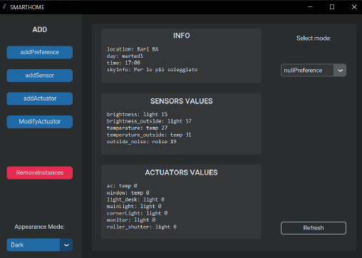
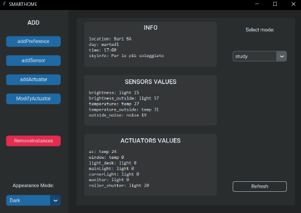

# SmartHome AI Project

## Overview

SmartHome AI is an innovative system aimed at enhancing the quality of daily life by creating smart environments that automatically adjust ambient parameters such as temperature, brightness, and noise. The system leverages the power of Python and Prolog to create a smart bedroom environment that aligns with user-defined preferences, ultimately promoting both comfort and energy efficiency.

## Code directory

```
└─── `SmartRoom`
      ├─── `conda`:  The files to setup a correct conda env
      ├─── `images`: All the images if any
      ├─── `src`:    Python and Prolog code
      │     └─── `knowledge_base`: Prolog KB (fact + rules)
      ├─── `README.md`
      └─── `.gitignore`
```

### Project Objectives

The primary goal of SmartHome AI is to improve user experiences in a smart bedroom setting by utilizing sensors and actuators to manage environmental factors. By doing so, the system seeks to:

- **Enhance Comfort**: Automatically adjust room conditions to meet the desired preferences of the user.
- **Promote Energy Efficiency**: Optimize the use of energy resources by intelligently managing devices and settings.
- **Simplify User Interaction**: Provide a user-friendly interface for setting preferences and managing the smart environment.

### System Components

The system comprises several key components that work together to create a responsive and adaptive smart environment:

- **Sensors**: The system includes sensors that monitor various environmental factors such as:
  - **Temperature**: Sensors detect the room's temperature, allowing the system to adjust heating or cooling devices as needed.
  - **Brightness**: Light sensors monitor the room's brightness level, enabling dynamic lighting adjustments.
  - **Noise**: Noise sensors detect ambient sound levels, facilitating noise control measures to maintain a comfortable atmosphere.

- **Actuators**: These are devices that the system controls to modify the room's environment, including:
  - **Lighting**: Actuators control different lighting sources, such as desk lamps and overhead lights, to maintain optimal brightness.
  - **Air Conditioning (AC)**: The system adjusts the AC to achieve the desired temperature settings.
  - **Windows and Roller Shutters**: Automated controls for windows and shutters help manage both brightness and temperature.

### System Functionality

- **Knowledge Base**: The system uses a Prolog-based knowledge base to define the relationships between environmental factors, sensors, and actuators. This allows for complex reasoning about how to achieve user preferences.

- **User Preferences**: Users can define preferences for different scenarios, such as studying or sleeping. These preferences include desired levels for temperature, brightness, and noise, and specify which actuators to adjust to meet these goals.

- **Automatic Adjustment**: The system continuously monitors the environment and applies the necessary adjustments to actuators based on real-time sensor data and user preferences. For instance, if the room's temperature is lower than desired, the system might open windows or activate the AC depending on external conditions.

### User Interface

The SmartHome AI project features an intuitive graphical user interface (GUI) that allows users to:

- View current environmental conditions and device statuses. The default (nullPreference) is active. 



- Set and modify user preferences. In the image below the study setup is activated, and the sensors and actuators values are changed accordingly. 



- Add or remove sensors and actuators as needed.

## Installation

To set up the SmartHome AI system, follow these steps:

1. **Python Dependencies**: Install the required Python libraries using `Conda`:
```bash
cd conda
conda env create --name smarthome --file=smarthome.yml
conda activate smarthome
```
or `Pip`
```bash
cd conda
pip install -r requirements.txt
```

2. **SWI-Prolog**: Download and install SWI-Prolog from [here](https://www.swi-prolog.org/Download.html).

## Execution

- **Windows**: Run the `main.bat` file located in the `src` folder.

- **Linux**: Navigate to the `src` directory and execute the following command:
```bash
python main.py
```

### Trouble
- In case of problem in launching the program, is adviced to clean up the mylog.pl file

## Contributing
Contributions to the SmartHome AI project are welcome. Feel free to submit issues or pull requests.

## Contact
For any questions or support, please contact the project developers:

- Gaetano Dibenedetto - [linkedin](https://www.linkedin.com/in/gaetano-dibenedetto/)
- Mauro Andretta - mauo.andretta222@gmail.com

We appreciate your interest in the SmartHome AI project and are here to help with any inquiries or feedback you may have!